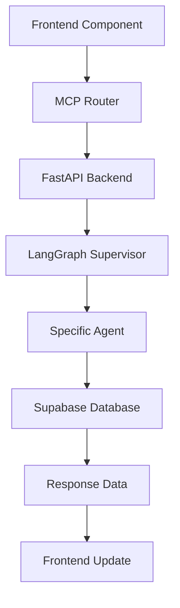
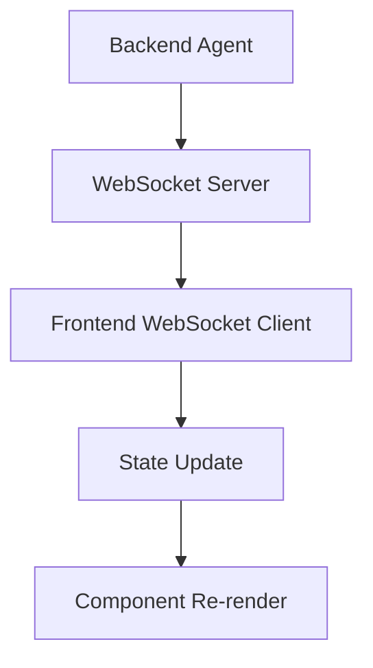
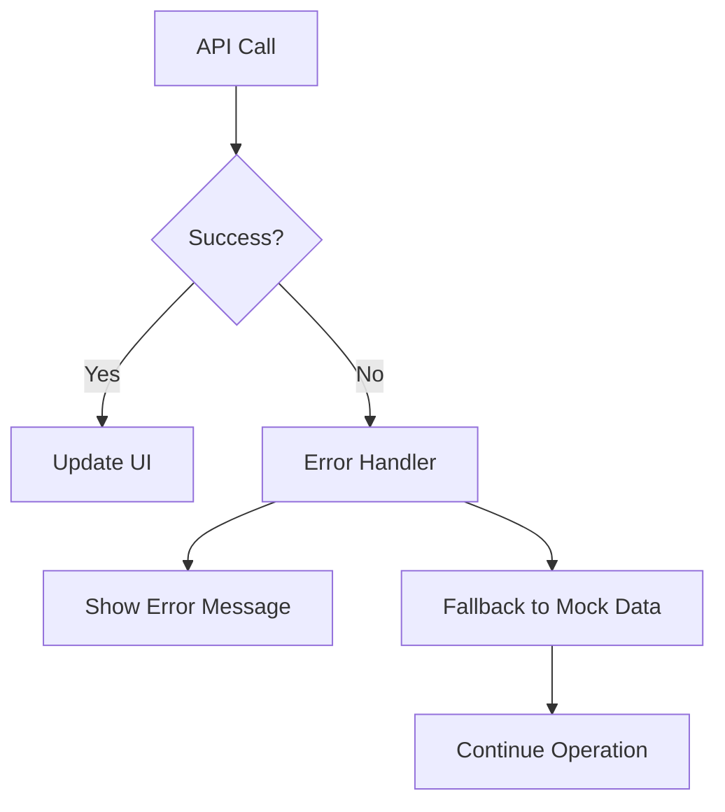

# Impact Realty AI Frontend Architecture Specification

## 🏗️ **ARCHITECTURAL OVERVIEW**

### **Core Philosophy**
The frontend serves as the **command center** for the Impact Realty AI multi-agent platform, providing real-time monitoring, control, and interaction with the hierarchical agent system. The design emphasizes **operational efficiency**, **real-time feedback**, and **professional aesthetics** suitable for real estate professionals.

### **Technology Stack**
- **Framework**: Next.js 14 (App Router)
- **Language**: TypeScript
- **Styling**: Tailwind CSS + Custom CSS
- **Icons**: Lucide React
- **Fonts**: Orbitron (headers), Inter (body)
- **State Management**: React hooks + Context API
- **Real-time**: WebSocket connections to FastAPI backend

---

## 🎨 **DESIGN SYSTEM & THEME**

### **DualCore Agent Theme**
```css
Primary Colors:
- Background: #0C0F1A (Deep space blue)
- Primary Accent: #00FFFF (Neon cyan)
- Secondary Accent: #00CED1 (Dark turquoise)
- Success: #10B981 (Emerald green)
- Warning: #F59E0B (Amber)
- Error: #EF4444 (Red)
- Text Primary: #FFFFFF (White)
- Text Secondary: #9CA3AF (Gray-400)
```

### **Typography Hierarchy**
```css
Headers: font-orbitron (futuristic, technical)
Body Text: font-inter (clean, readable)
Code/Data: font-mono (monospace)

Sizes:
- H1: text-3xl font-bold (Dashboard titles)
- H2: text-xl font-semibold (Section headers)
- H3: text-lg font-medium (Subsections)
- Body: text-base (Regular content)
- Caption: text-sm (Metadata, timestamps)
```

### **Component Styling Patterns**
```css
Cards: card-bg class (gradient background with borders)
Buttons: neon-button class (glowing cyan accent)
Inputs: Dark background with cyan focus states
Loading: Spinning cyan rings with pulse effects
Status Indicators: Colored dots with animations
```

---

## 📁 **DIRECTORY STRUCTURE**

```
frontend/
├── app/                          # Next.js 14 App Router
│   ├── layout.tsx               # Root layout with sidebar/topnav
│   ├── page.tsx                 # Redirect to dashboard
│   ├── globals.css              # Global styles & theme
│   ├── dashboard/
│   │   └── page.tsx            # Main control center
│   ├── compliance/
│   │   └── page.tsx            # Karen agent interface
│   ├── recruiting/
│   │   └── page.tsx            # Eileen agent interface
│   ├── investments/
│   │   └── page.tsx            # Kevin agent interface
│   ├── logs/
│   │   └── page.tsx            # System logs & monitoring
│   └── admin/
│       └── page.tsx            # System administration
├── components/                   # Reusable UI components
│   ├── Sidebar.tsx              # Navigation sidebar
│   ├── TopNav.tsx               # Top navigation bar
│   ├── AgentStatusCard.tsx      # Agent monitoring widget
│   ├── KPIWidget.tsx            # Metrics display widget
│   ├── ComplianceTable.tsx      # Compliance data table
│   ├── RecruitingPipeline.tsx   # Recruiting workflow
│   ├── InvestmentPanel.tsx      # Investment analysis
│   ├── LogViewer.tsx            # Log streaming component
│   └── AdminConfigPanel.tsx     # System configuration
├── utils/                        # Utility functions
│   ├── supabaseClient.ts        # Database client
│   ├── mcpRouter.ts             # Agent communication
│   └── formatters.ts            # Data formatting
└── types/                        # TypeScript definitions
    ├── agents.ts                # Agent-related types
    ├── database.ts              # Database schema types
    └── api.ts                   # API response types
```

---

## 🔗 **BACKEND INTEGRATION ARCHITECTURE**

### **Communication Layers**

#### **1. MCP Router (`utils/mcpRouter.ts`)**
```typescript
// Primary interface to Python backend
class MCPRouter {
  // Agent invocation
  async invokeAgent(agentId: string, payload: any): Promise<MCPResponse>
  
  // Real-time status monitoring
  async getAgentStatus(agentId: string): Promise<AgentStatus>
  
  // Workflow orchestration
  async executeWorkflow(type: string, params: any): Promise<WorkflowResult>
  
  // Health monitoring
  async healthCheck(): Promise<SystemHealth>
}
```

#### **2. Supabase Client (`utils/supabaseClient.ts`)**
```typescript
// Database operations
class SupabaseClient {
  // Agent data retrieval
  async getAgentStatuses(): Promise<AgentStatus[]>
  
  // Compliance records
  async getComplianceRecords(): Promise<ComplianceRecord[]>
  
  // Investment data
  async getInvestmentData(): Promise<Investment[]>
  
  // Recruiting pipeline
  async getRecruitingData(): Promise<Candidate[]>
}
```

#### **3. Real-time WebSocket Connection**
```typescript
// Live updates from backend
const wsConnection = new WebSocket('ws://localhost:8000/ws')
wsConnection.onmessage = (event) => {
  const update = JSON.parse(event.data)
  // Update UI components in real-time
}
```

---

## 📱 **PAGE ARCHITECTURE**

### **Consistent Page Structure**
Every page follows this standardized layout:

```typescript
export default function PageName() {
  return (
    <div className="space-y-8">
      {/* 1. Header Section */}
      <HeaderSection 
        title="PAGE TITLE"
        description="Page description"
        actions={<ActionButtons />}
      />
      
      {/* 2. Stats Overview */}
      <StatsGrid>
        <KPIWidget metric="key_metric_1" />
        <KPIWidget metric="key_metric_2" />
        <KPIWidget metric="key_metric_3" />
        <KPIWidget metric="key_metric_4" />
      </StatsGrid>
      
      {/* 3. Agent Status */}
      <AgentStatusSection>
        <AgentStatusCard agentId="relevant_agent" />
      </AgentStatusSection>
      
      {/* 4. Main Content */}
      <MainContentArea>
        {/* Page-specific components */}
      </MainContentArea>
      
      {/* 5. Quick Actions */}
      <QuickActionsPanel>
        {/* Page-specific actions */}
      </QuickActionsPanel>
    </div>
  )
}
```

### **Page-Specific Implementations**

#### **Dashboard (`/dashboard`)**
- **Purpose**: Central command center
- **Agent Focus**: Supervisor agent
- **Key Components**: System overview, all agent statuses, workflow controls
- **Data Sources**: All agents via MCP Router

#### **Compliance (`/compliance`)**
- **Purpose**: Karen agent interface
- **Agent Focus**: Compliance agent
- **Key Components**: ComplianceTable, audit controls, document validation
- **Data Sources**: Compliance records from Supabase + Karen agent status

#### **Recruiting (`/recruiting`)**
- **Purpose**: Eileen agent interface  
- **Agent Focus**: Recruiting agent
- **Key Components**: RecruitingPipeline, candidate management, outreach tools
- **Data Sources**: Candidate data from Supabase + Eileen agent status

#### **Investments (`/investments`)**
- **Purpose**: Kevin agent interface
- **Agent Focus**: Analytics/Investment agent
- **Key Components**: InvestmentPanel, ROI analysis, deal management
- **Data Sources**: Investment data from Supabase + Kevin agent status

#### **Logs (`/logs`)**
- **Purpose**: System monitoring
- **Agent Focus**: All agents
- **Key Components**: LogViewer, filtering, export capabilities
- **Data Sources**: Real-time log streaming from backend

#### **Admin (`/admin`)**
- **Purpose**: System administration
- **Agent Focus**: Supervisor + system management
- **Key Components**: AdminConfigPanel, agent management, diagnostics
- **Data Sources**: System health data + configuration management

---

## 🧩 **COMPONENT ARCHITECTURE**

### **Core Navigation Components**

#### **Sidebar (`components/Sidebar.tsx`)**
```typescript
// Collapsible navigation with active state tracking
- Logo/branding area
- Navigation menu (6 main pages)
- System status indicator
- Collapse/expand functionality
```

#### **TopNav (`components/TopNav.tsx`)**
```typescript
// System status and user controls
- Current page indicator
- System metrics (CPU, memory)
- Notifications bell
- User profile menu
```

### **Data Display Components**

#### **AgentStatusCard (`components/AgentStatusCard.tsx`)**
```typescript
// Real-time agent monitoring
interface AgentStatusCardProps {
  agentId: string
  showDetails?: boolean
  onAction?: (action: string) => void
}
```

#### **KPIWidget (`components/KPIWidget.tsx`)**
```typescript
// Metrics display with trends
interface KPIWidgetProps {
  title: string
  value: number | string
  trend?: 'up' | 'down' | 'stable'
  format?: 'number' | 'currency' | 'percentage'
}
```

### **Specialized Components**

#### **ComplianceTable (`components/ComplianceTable.tsx`)**
```typescript
// Compliance data with filtering and actions
- Sortable columns
- Status indicators
- Action buttons (review, approve, flag)
- Export functionality
```

#### **RecruitingPipeline (`components/RecruitingPipeline.tsx`)**
```typescript
// Candidate workflow visualization
- Pipeline stages
- Drag-and-drop functionality
- Candidate cards with actions
- Progress tracking
```

#### **InvestmentPanel (`components/InvestmentPanel.tsx`)**
```typescript
// Investment analysis and projections
- ROI calculations
- Risk assessments
- Deal comparisons
- Performance charts
```

---

## 🔄 **DATA FLOW ARCHITECTURE**

### **Frontend → Backend Communication**



### **Real-time Updates**



### **Error Handling Flow**



---

## 🎯 **USER EXPERIENCE DESIGN**

### **Navigation Patterns**
1. **Primary Navigation**: Sidebar with 6 main sections
2. **Contextual Actions**: Page-specific action buttons in headers
3. **Quick Actions**: Bottom panels for common tasks
4. **Breadcrumbs**: Not needed due to flat hierarchy

### **Information Hierarchy**
1. **System Status**: Always visible in top nav
2. **Page Context**: Clear headers with descriptions
3. **Key Metrics**: Prominent KPI widgets
4. **Agent Status**: Real-time monitoring cards
5. **Detailed Data**: Tables and panels below the fold

### **Interaction Patterns**
- **Hover States**: Subtle glow effects on interactive elements
- **Loading States**: Spinning cyan rings with consistent timing
- **Success Feedback**: Green checkmarks and success messages
- **Error Handling**: Red indicators with clear error messages
- **Real-time Updates**: Smooth animations for data changes

### **Responsive Design**
- **Desktop First**: Optimized for 1920x1080+ screens
- **Tablet Support**: Collapsible sidebar, stacked layouts
- **Mobile Considerations**: Essential functionality only

---

## 🔧 **TECHNICAL IMPLEMENTATION**

### **State Management Strategy**
```typescript
// Page-level state for data
const [agentData, setAgentData] = useState<AgentData[]>([])
const [loading, setLoading] = useState(true)
const [error, setError] = useState<string | null>(null)

// Global state for system status
const SystemContext = createContext<SystemState>()

// Real-time updates via WebSocket
useEffect(() => {
  const ws = new WebSocket('ws://localhost:8000/ws')
  ws.onmessage = handleRealtimeUpdate
  return () => ws.close()
}, [])
```

### **Error Boundaries**
```typescript
// Graceful error handling at component level
<ErrorBoundary fallback={<ErrorFallback />}>
  <PageComponent />
</ErrorBoundary>
```

### **Performance Optimizations**
- **Code Splitting**: Dynamic imports for heavy components
- **Memoization**: React.memo for expensive renders
- **Virtual Scrolling**: For large data tables
- **Image Optimization**: Next.js Image component
- **Bundle Analysis**: Regular bundle size monitoring

---

## 🚀 **DEPLOYMENT & ENVIRONMENT**

### **Environment Configuration**
```bash
# .env.local
NEXT_PUBLIC_API_URL=http://localhost:8000
NEXT_PUBLIC_WS_URL=ws://localhost:8000/ws
NEXT_PUBLIC_SUPABASE_URL=your_supabase_url
NEXT_PUBLIC_SUPABASE_ANON_KEY=your_supabase_key
```

### **Build Process**
```bash
# Development
npm run dev

# Production build
npm run build
npm run start

# Type checking
npm run type-check

# Linting
npm run lint
```

### **Deployment Targets**
- **Development**: Local development server
- **Staging**: Vercel preview deployments
- **Production**: Vercel production with custom domain

---

## 📊 **SUCCESS METRICS**

### **Performance Targets**
- **First Contentful Paint**: < 1.5s
- **Largest Contentful Paint**: < 2.5s
- **Time to Interactive**: < 3.0s
- **Cumulative Layout Shift**: < 0.1

### **User Experience Goals**
- **Agent Response Time**: < 2s for status updates
- **Data Refresh Rate**: 30s intervals for real-time data
- **Error Recovery**: Automatic retry with exponential backoff
- **Offline Capability**: Graceful degradation with cached data

---

This architecture provides a **scalable**, **maintainable**, and **user-friendly** frontend that seamlessly integrates with the Python LangGraph backend while maintaining the professional DualCore Agent aesthetic throughout the entire application.